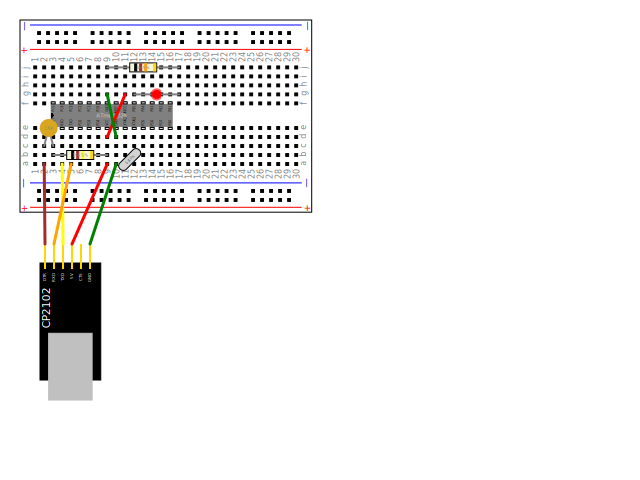

The goal is to create a simple, intuitive DSL that allows you to describe a
breadboard-based electronics project and then *automatically*
1. draw a diagram of the project, and
2. generate step-by-step instructions in markdown ready for publication

The design is based on earlier closed-source tools of mine which worked but needed
improvement.

# Using the DSL

1. You typically start a project by creating a Project instance.
1. Then you add a Breadboard instance, and maybe other things, like an Arduino or Pi.
1. After that, you add wires and components.
1. When you've added all you need you can generate svg and (eventually)
generate markdown for the project.

## Current status

All the tests are running again.

## Sample script and its output 
   
    def shrimp_kit():
        project = Project()
        breadboard = Breadboard().move_to(Point(20, 20))
        project.add(breadboard)
        cp = CP2102().rotate(-90., Point(40,400)).move_to(Point(40,400))
        project.add(cp,
                Wire('green',cp['GND'],breadboard['a10']),
                Wire('red',cp['5V'],breadboard['a9']),
                Wire('yellow',cp['TXD'],breadboard['a4']),
                Wire('orange',cp['RXD'],breadboard['a5']),
                Wire('brown',cp['DTR'],breadboard['a2']),
                atMega328(breadboard['f3']),
                Wire('red',breadboard['d9'],breadboard['g11']),
                Wire('green',breadboard['d10'],breadboard['g9']),
                Crystal('16Mz', breadboard['a11'], breadboard['b12']),
                Resistor('10k', '5%', breadboard['b3'], breadboard['b9']),
                Resistor('1k', '5%', breadboard['j9'], breadboard['j17']),
                DiskCapacitor('1N4', breadboard['c2'], breadboard['c3']),
                LED('red',breadboard['g12'],breadboard['g17']))
        return project
    
    shrimp = shrimp_kit.shrimp_kit()
    file_writer = FileBasedPublicationWriter('manuscript', 'test')
    make_book(shrimp, file_writer, options=Editor.PictureAtEnd)
    

# Output

*(all generated from the script above)*

1. Take a Breadboard (BB1)
1. Take a CP2102 UART (CP2102-1)
1. Connect a Green Jumper Wire (F-M) from CP2102-1 pin GND to BB1 socket a10
1. Connect a Red Jumper Wire (F-M) from CP2102-1 pin 5V to BB1 socket a9
1. Connect a Yellow Jumper Wire (F-M) from CP2102-1 pin TXD to BB1 socket a4
1. Connect a Orange Jumper Wire (F-M) from CP2102-1 pin RXD to BB1 socket a5
1. Connect a Brown Jumper Wire (F-M) from CP2102-1 pin DTR to BB1 socket a2
1. Insert pin 1 of the ATmega328 (IC1) into BB1 socket f3
1. Connect a Red Jumper Wire (M-M) from BB1 socket d9 to BB1 socket g11
1. Connect a Green Jumper Wire (M-M) from BB1 socket d10 to BB1 socket g9
1. Connect a Crystal X1: (16Mz) from BB1 socket a11 to BB1 socket b12
1. Connect a Resistor R1: 10k 5% (Black Brown Yellow Gold) from BB1 socket b3 to BB1 socket b9
1. Connect a Resistor R2: 1k 5% (Black Brown Orange Gold) from BB1 socket j9 to BB1 socket j17
1. Connect a Capacitor C1: (1N4) from BB1 socket c2 to BB1 socket c3
1. Connect a LED LED1: () from BB1 socket g12 to BB1 socket g17

The Shrimp kit and relatives are described at and available from
the [Shrimping.It website](http://start.shrimping.it/).

## Testing

Most testing is now visual testing based on [appraise](https://github.com/AppraiseQA/appraise)
- a node-based tool.

The [roadmap](ROADMAP.md) includes plans to replace this by a Python
equivalent which would simplify automated testing using Travis.