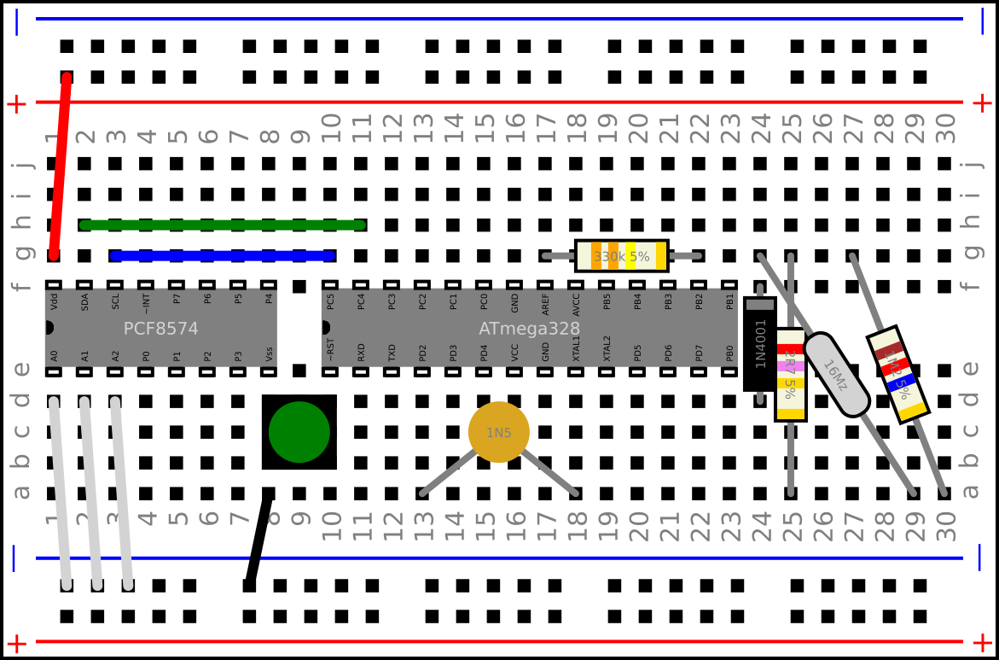

The goal is to create a simple, intuitive DSL that allows you to describe a
breadboard-based electronics project and then *automatically*
1. draw a diagram of the project, and
2. generate step-by-step instructions in markdown ready for publication

The design is based on earlier closed-source tools which worked but needed
improvement.

# Using the DSL

1. You typically start a project by creating a Drawing instance.
1. Then you add a Breadboard instance, and maybe other things, like an Arduino or Pi.
1. After that, you add wires and components.
1. When you've added all you need you can generate svg and (eventually)
generate markdown for the project.

## Current status

The core of the image generator is working but there's work to do adding
components like capacitors, diodes and transistors.

I have not started on the text/markdown generator yet  but I do not anticipate any major
difficulties.

## Sample script and its output 
   
    def test_dil():
        project = Project()
        breadboard = Breadboard()
        project.add(breadboard)
        project.add(atMega328(breadboard['f10']))
        project.add(pcf8574(breadboard['f1']))
        project.add(Wire('red',breadboard['g1'],breadboard['TP1']))
        project.add(Wire('black',breadboard['a8'],breadboard['BM6']))
        project.add(Wire('blue',breadboard['g3'],breadboard['g10']))
        project.add(Wire('green',breadboard['h2'],breadboard['h11']))
        project.add(Wire('lightgrey',breadboard['d1'],breadboard['BM1']))
        project.add(Wire('lightgrey',breadboard['d2'],breadboard['BM2']))
        project.add(Wire('lightgrey',breadboard['d3'],breadboard['BM3']))
        project.add(Button(breadboard['d8']))
        project.add(Resistor('330k', '5%', breadboard['g17'],breadboard['g22']))
        project.add(Resistor('2R7', '5%', breadboard['g25'],breadboard['a25']))
        project.add(Resistor('1M2', '5%', breadboard['g27'],breadboard['a30']))
        project.add(Crystal('16Mz', breadboard['g24'],breadboard['a29']))
        project.add(Diode('1N4001', breadboard['d24'],breadboard['f24']))
        project.add(DiskCapacitor('1N5', breadboard['a13'],breadboard['a18']))
        svg = project.svg()
        write(svg, 'svg/dil.svg')
        
       
### Output
