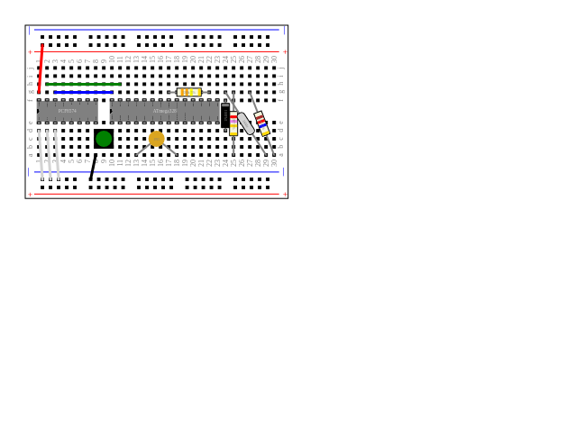

This paragraph is just an intro, it will be ignored for testing

~~~yaml example="dil" fixture="hello.js"
filename: file:///home/romilly/git/active/breadboarder/svg/dil.svg
~~~

## dil (shrimping.it-ish) example

(generated: 2018-4-11 14:55:43)

