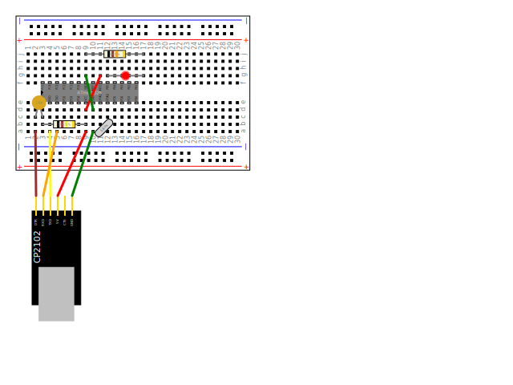

# Making the shrimp

## Bill of Materials

### Breadboard

BB1: 480-way Breadboard

### CP2102

CP2102 UART

### Capacitor

Capacitor C1: (1N4)

### Crystal

Crystal X1: (16Mz)

### Integrated Circuit

ATmega328

### Jumper Wires

Green Jumper Wire (F-M), Red Jumper Wire (F-M), Yellow Jumper Wire (F-M), Orange Jumper Wire (F-M), Brown Jumper Wire (F-M), Red Jumper Wire (M-M), Green Jumper Wire (M-M)

### LED

LED LED1: ()

### Resistors

Resistor R1: 10k 5% (Black Brown Yellow Gold), Resistor R2: 1k 5% (Black Brown Orange Gold)

1. Take a Breadboard (BB1)
1. Take a CP2102 UART (CP2102-1)
1. Connect a Green Jumper Wire (F-M) from CP2102-1 pin GND to BB1 socket a10
1. Connect a Red Jumper Wire (F-M) from CP2102-1 pin 5V to BB1 socket a9
1. Connect a Yellow Jumper Wire (F-M) from CP2102-1 pin TXD to BB1 socket a4
1. Connect a Orange Jumper Wire (F-M) from CP2102-1 pin RXD to BB1 socket a5
1. Connect a Brown Jumper Wire (F-M) from CP2102-1 pin DTR to BB1 socket a2
1. Insert pin 1 of the ATmega328 (IC1) into BB1 socket f3
1. Connect a Red Jumper Wire (M-M) from BB1 socket d9 to BB1 socket g11
1. Connect a Green Jumper Wire (M-M) from BB1 socket d10 to BB1 socket g9
1. Connect a Crystal X1: (16Mz) from BB1 socket a11 to BB1 socket b12
1. Connect a Resistor R1: 10k 5% (Black Brown Yellow Gold) from BB1 socket b3 to BB1 socket b9
1. Connect a Resistor R2: 1k 5% (Black Brown Orange Gold) from BB1 socket j9 to BB1 socket j17
1. Connect a Capacitor C1: (1N4) from BB1 socket c2 to BB1 socket c3
1. Connect a LED LED1: () from BB1 socket g12 to BB1 socket g17

